# Architecture

> **Scope**: Complete system architecture — backend, frontend, auth, payments, email, downloads, communication, and the planned Admin Portal.
> **Supersedes**: the former `ARCHIVE/ARCHITECTURE.md`, `ARCHIVE/ACCOUNT_SYSTEM_ARCHITECTURE.md`, `ARCHIVE/USER_MODEL.md`, `ARCHIVE/BETTER_AUTH_IMPLEMENTATION.md`, `ARCHIVE/GUEST_PURCHASE_LINKING.md`.
> **Related**: `DATABASE.md`, `API_REFERENCE.md`, `SECURITY.md`, `EMAIL_SYSTEM.md`.

---

## High-Level Architecture

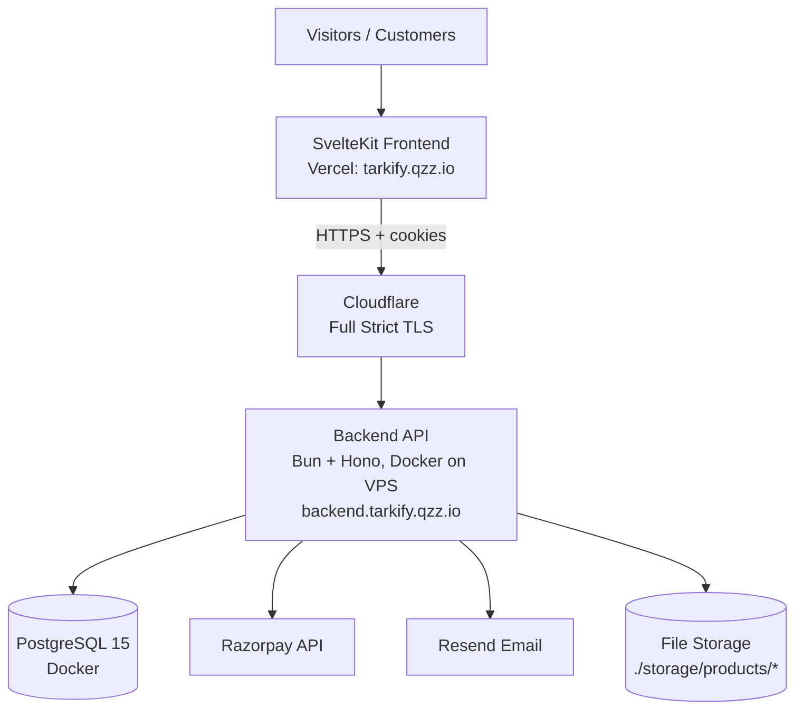

The frontend is **presentation only** — no secrets, no payment verification, no database access. All business logic lives in the backend.

---

## Tech Stack

| Layer | Technology |
|-------|------------|
| Frontend runtime | SvelteKit (Svelte 5) |
| Frontend language | TypeScript |
| Frontend styling | Tailwind CSS v4 |
| Frontend icons | Lucide |
| Frontend adapter | `@sveltejs/adapter-node` |
| Frontend hosting | Vercel |
| Backend runtime | Bun |
| Backend framework | Hono |
| Backend DB driver | `pg` (node-postgres, raw SQL, no ORM) |
| Database | PostgreSQL 15 (Docker Alpine) |
| Authentication | Better Auth |
| Payments | Razorpay |
| Email | Resend |
| Containerization | Docker + Docker Compose |
| Edge / TLS | Cloudflare |
| Backend hosting | VPS (Docker Compose) |

---

## Request Flow

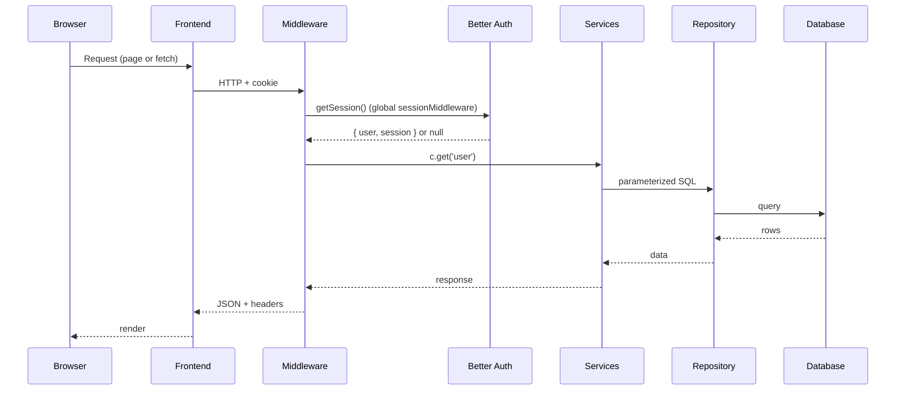

The `sessionMiddleware` runs on **every** route and attaches `{ user, session }` to the Hono context. Routes that don't need auth simply ignore it. Protected routes call `requireAuth` / `requireRole`.

---

## Backend Architecture

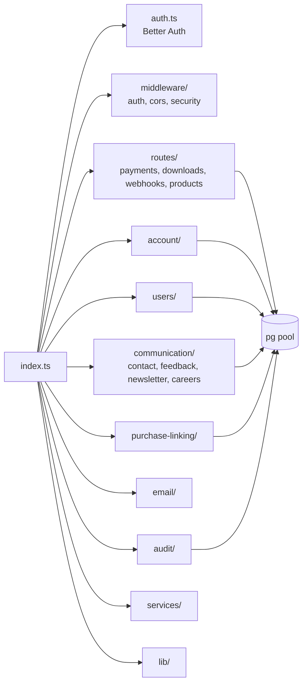

- **No ORM** — raw parameterized SQL via a shared `pg` pool.
- **Migration runner**: `scripts/migrate.ts` with a `_migrations` tracking table.
- **Rate limiter**: in-memory IP sliding window.
- **Global middleware**: CORS, security headers (incl. CSP), body-size limit, request ID, session.

---

## Frontend Architecture

```mermaid
flowchart TD
    RL[+layout.svelte<br/>Navbar + Footer + Theme + Toast] --> HOME[/]
    RL --> SOL[solutions/[id]]
    RL --> CONT[contact/]
    RL --> CARE[careers/]
    RL --> DISC[discover/[slug]]
    RL --> ACCT[/account/*<br/>Auth layout + Sidebar]

    ACCT --> DASH[dashboard]
    ACCT --> PROF[profile]
    ACCT --> PUR[purchases/[id]]
    ACCT --> DL[downloads]
    ACCT --> BIL[billing]
    ACCT --> SET[settings]

    LIB[lib/api/*] -->|fetch credentials:include| API[/api/*]
```

- Presentation only; typed API layer under `src/lib/api/*`.
- Authenticated area under `/account` guarded by an auth layout + session check.
- Reusable components under `src/lib/components` (`layout/`, `ui/`, `account/`, `home/`).

---

## Authentication & Authorization

### 6.1 Auth Boundary

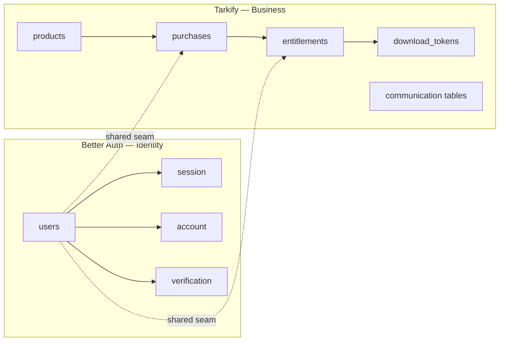

- **Better Auth owns identity**: `users`, `account`, `session`, `verification`. It creates rows, hashes passwords, validates sessions, issues cookies, generates email tokens.
- **Tarkify owns business data**: `products`, `purchases`, `entitlements`, `download_tokens`, communication tables.
- The `users` table is the **shared seam**: Better Auth creates rows; Tarkify reads/extends them (`role`, `display_name`, `timezone`, `preferences`, `account_status`, activity timestamps).

### 6.2 RBAC

Three roles live in `users.role` (TEXT, CHECK): `customer`, `admin`, `super_admin`. The full route-protection matrix and `requireAuth` / `requireRole` middleware are defined authoritatively in `SECURITY.md#authorization` (the Admin Portal plan extends them in `ADMIN_PORTAL_ARCHITECTURE.md#rbac`).

Roles are coarse (no granular permission tables yet) — sufficient at current scale and extensible later.

### 6.3 Session Lifecycle

- Cookie: `HttpOnly`, `Secure` (prod), `SameSite=Lax`, prefix `tarkify`.
- 7-day default; 30-day with "Remember me"; 1-day sliding refresh; 5-minute cookie cache.
- DB-backed `session` table; revocation endpoints (`revoke-session`, `revoke-other-sessions`).

---

## Guest Purchase Linking

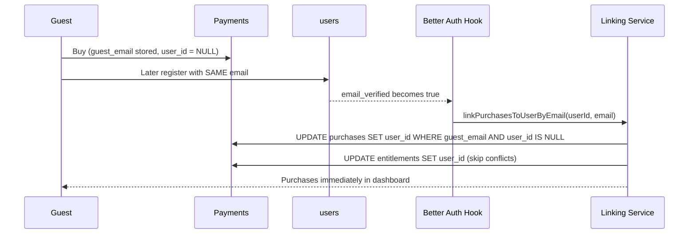

- Triggered by Better Auth's `databaseHooks.user.update.after` on email verification.
- Runs inside a single DB transaction (atomic).
- **Idempotent**: `WHERE user_id IS NULL` prevents re-linking.
- Conflicting duplicate guest entitlements are skipped and deleted.
- Logged to `purchase_linking_log`.
- See `DATABASE.md` and `API_REFERENCE.md`.

---

## Payment Flow

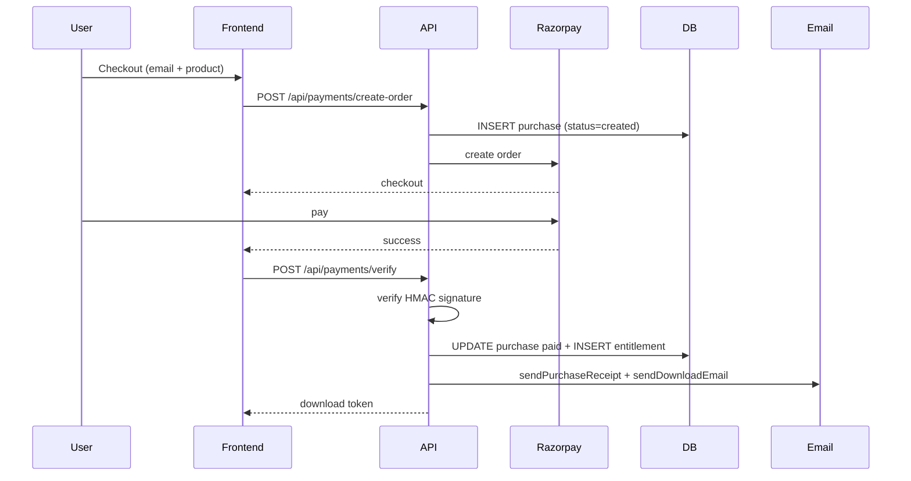

- Idempotent: atomic `INSERT ... WHERE NOT EXISTS` + partial unique index on `(guest_email, product_id)`.
- Refund webhook (`payment.refunded`) revokes entitlement + expires download tokens.
- Razorpay webhooks are HMAC-verified and idempotent.

---

## Download Flow

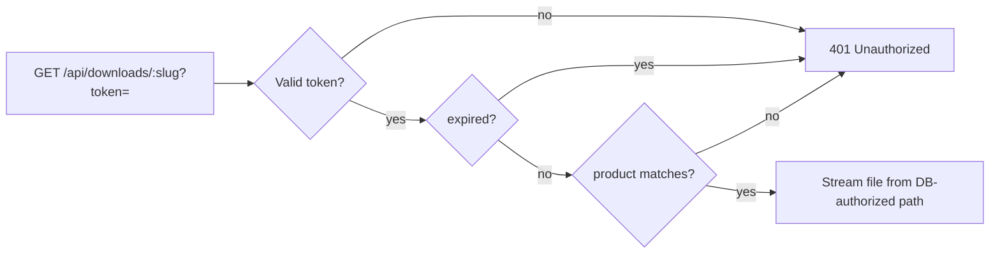

- 32-byte crypto token, time-limited (default 600s, `DOWNLOAD_TOKEN_TTL_SECONDS`).
- `download_key` comes from the DB (never user input) → no path traversal.
- Authenticated users generate fresh tokens via `POST /api/account/downloads/:purchaseId`.

---

## Email Flow

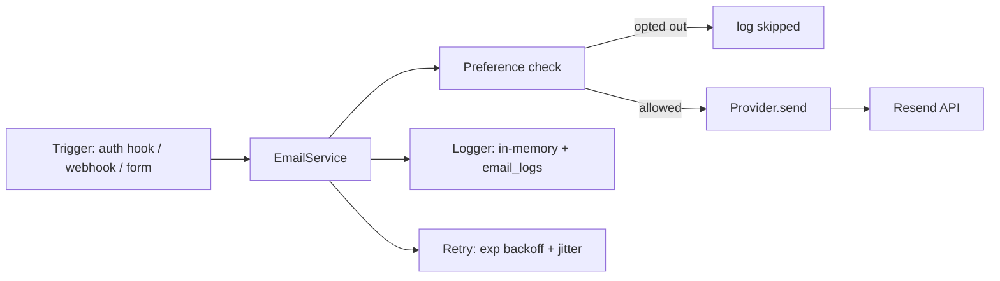

- Provider abstraction (`EmailProvider` interface); Resend is the only implementation.
- 10 templates built from reusable components; preview at `GET /api/email-previews`.
- See `EMAIL_SYSTEM.md`.

---

## OAuth Flow (Google, opt-in)

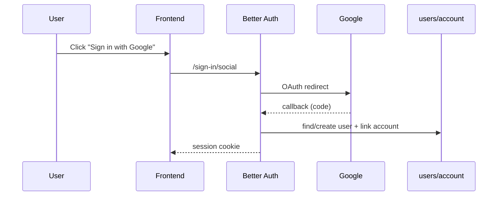

- Implemented (migration `016_add_oauth_support.sql`) but **disabled unless** `GOOGLE_CLIENT_ID` + `GOOGLE_CLIENT_SECRET` are set.
- Same-site requirement: frontend and backend must share an eTLD+1 for `SameSite=Lax` cookies.
- Account linking for matching emails is supported.

---

## Communication Module Architecture

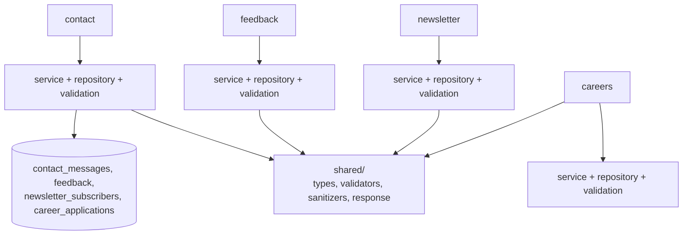

- Shared `sanitizers` strip `<script>`, event handlers, HTML tags, `javascript:`, and C0/C1 control chars before storage.
- Newsletter insert is atomic (`INSERT ... ON CONFLICT DO NOTHING`) — idempotent.
- All tables have `status`, `archived_at`, `metadata`, and an `updated_at` trigger.

---

## Customer Portal Architecture

- Authenticated SvelteKit area at `/account`: dashboard, profile, purchases, purchase detail, downloads, billing, settings.
- `account/+layout.svelte` runs a session check; redirects to `/account/login` if unauthenticated.
- Consumes the Customer API (`/api/account/*`) client-side via `$lib/api/account.ts`.
- Detail in `CUSTOMER_PORTAL.md`.

---

## Future Admin Portal Architecture (Overview)

Planned next phase. Full plan in `ADMIN_PORTAL_ARCHITECTURE.md`.

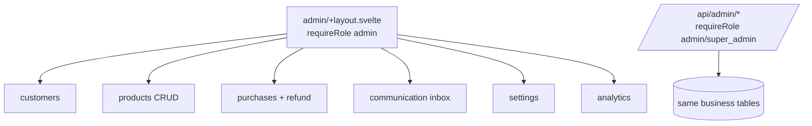

- Reuses existing business tables; reads through role-protected routes.
- Super-admin-only: admin management, system settings, analytics.

---

## Folder Structure

### Backend (`backend/`)
```
src/
  auth.ts                 Better Auth instance
  config.ts              env validation + production guards
  db.ts                  pg pool
  index.ts               Hono app, middleware, route mounting
  users/  account/      user + account APIs
  communication/          contact/ feedback/ newsletter/ careers/ + shared/
  purchase-linking/       guest→user linking
  email/                 provider, service, templates, components, preferences, logger, retry, preview
  audit/                 audit logging
  middleware/            auth, cors, security
  routes/                payments, downloads, webhooks, products
  services/ lib/ types/  shared logic
migrations/             001–016 SQL
scripts/migrate.ts       migration runner
tests/                  unit tests
```

### Frontend (`frontend/`)
```
src/
  lib/api/              typed API clients
  lib/components/        layout/ ui/ account/ home/ + Newsletter, FeedbackForm, PurchaseModal
  lib/context/          auth, theme, toast stores
  lib/data/ services/ types/ utils/
  routes/               /account/*, /contact, /careers, /discover, /login, /register,
                          /forgot-password, /reset-password, /solutions, /privacy, /terms
```

### Shared
No fully shared code module; types are duplicated between `frontend/src/lib/types` and `backend/src/types` by design (frontend never imports backend).

---

## Module Relationships

| Module | Depends on | Adds |
|--------|-------------|--------|
| Better Auth | — | identity |
| User Model / RBAC | Better Auth | roles, profile, authorization |
| Guest Linking | Auth + User | links purchases |
| Customer Portal | All above | reads purchases/entitlements |
| Downloads | Purchases + Entitlements | token service |
| Billing | Purchases | read-only view |
| Settings | Better Auth | password change |
| Admin Portal (planned) | All | role-protected reads/writes |
| OAuth (opt-in) | Better Auth | social providers |
| SaaS features (future) | All | new tables only |

---

## Future Scalability

**All future features add new tables** (or optional nullable columns) — no existing column is modified, removed, or has its constraint tightened. Existing data always remains valid.

| Future feature | Migration | Conflict? |
|----------------|-----------|-----------|
| Subscriptions | `subscriptions` table | No (new table) |
| Organizations | `organizations`, `org_members` | No |
| API Keys | `api_keys` | No |
| AI Credits | `credits` | No |
| Licenses | `licenses` | No |
| Invoices | `invoice_id` on `purchases` (nullable) | Minor |
| Notifications | `notifications` | No |

Security boundaries never cross: Better Auth never reads purchase data; Tarkify never reads password hashes.

---

*This is the master architecture document. For schema detail see `DATABASE.md`; for endpoints see `API_REFERENCE.md`; for security see `SECURITY.md`.*
