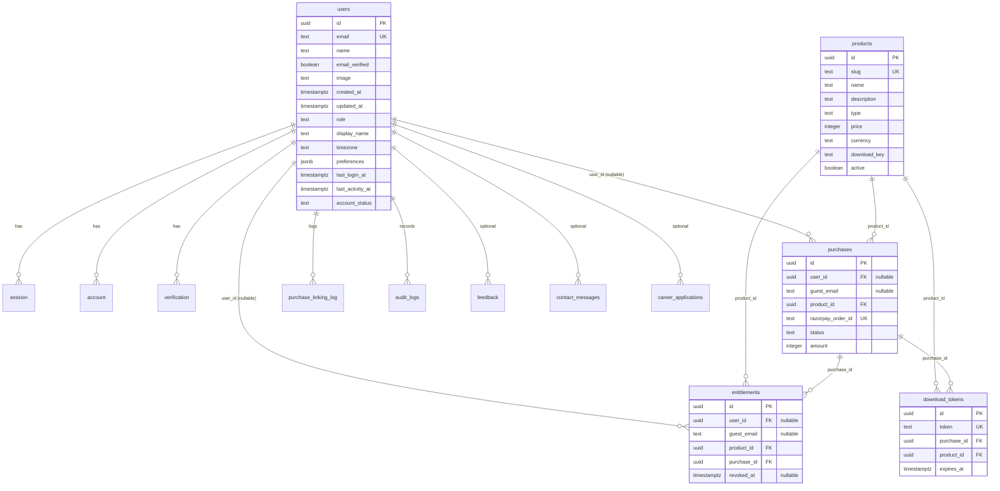

# Database

> **Scope**: Schema, relationships, indexes, constraints, ownership, migrations.
> **Driver**: `pg` (node-postgres), raw parameterized SQL — **no ORM**.
> **Related**: `ARCHITECTURE.md`, `API_REFERENCE.md`.

---

## 1. Ownership Rules

Two ownership domains share one database:

| Domain | Owner | Tables |
|--------|-------|--------|
| Identity | **Better Auth** | `users`, `account`, `session`, `verification` |
| Business | **Tarkify** | `products`, `purchases`, `entitlements`, `download_tokens`, communication tables, `purchase_linking_log`, `audit_logs`, `email_logs` |

- Better Auth **creates and manages** identity tables.
- Tarkify **creates and manages** business tables.
- The `users` table is the **shared seam**: Better Auth creates rows; Tarkify reads/extends them (`role`, `display_name`, `timezone`, `preferences`, `account_status`, activity timestamps).
- Better Auth never reads purchase data; Tarkify never reads password hashes.

---

## 2. ER Diagram

---

## 3. Authentication Tables (Better Auth)

### `users`
Primary key `id` is a **UUID** (Better Auth configured with `generateId: crypto.randomUUID()`).

| Column | Type | Default | Constraint | Owner |
|--------|------|---------|------------|-------|
| `id` | UUID | `gen_random_uuid()` | PK | Better Auth |
| `email` | TEXT | — | NOT NULL, UNIQUE | Better Auth |
| `name` | TEXT | — | — | Better Auth |
| `email_verified` | BOOLEAN | `false` | NOT NULL | Better Auth |
| `image` | TEXT | — | — | Better Auth |
| `created_at` | TIMESTAMPTZ | `NOW()` | NOT NULL | Better Auth |
| `updated_at` | TIMESTAMPTZ | `NOW()` | NOT NULL | Better Auth |
| `role` | TEXT | `'customer'` | CHECK `customer/admin/super_admin` | Tarkify |
| `display_name` | TEXT | — | — | Tarkify |
| `timezone` | TEXT | `'UTC'` | — | Tarkify |
| `preferences` | JSONB | `'{}'` | NOT NULL | Tarkify |
| `last_login_at` | TIMESTAMPTZ | — | — | Tarkify |
| `last_activity_at` | TIMESTAMPTZ | — | — | Tarkify |
| `account_status` | TEXT | `'ACTIVE'` | CHECK `ACTIVE/SUSPENDED/DELETED` | Tarkify |

Indexes: `idx_users_email`, `idx_users_role`.

### `account`
OAuth / password provider accounts. `id` TEXT PK. `user_id` TEXT FK → `users(id)` ON DELETE CASCADE. Columns include `provider_id`, `provider_account_id`, `access_token`, `refresh_token`, `id_token`, `expires_at`, `scope`, timestamps.

### `session`
Active sessions. `id` TEXT PK. `user_id` TEXT FK → `users(id)`. `token` TEXT UNIQUE. `expires_at` TIMESTAMPTZ. `ip_address`, `user_agent`, timestamps.

### `verification`
One-time codes for email verification + password reset. `id` TEXT PK. `identifier` TEXT (email). `value` TEXT. `expires_at` TIMESTAMPTZ.

---

## 4. Business Tables

### `products`
| Column | Type | Constraint |
|--------|------|------------|
| `id` | UUID | PK |
| `slug` | TEXT | NOT NULL, UNIQUE |
| `name` | TEXT | NOT NULL |
| `description` | TEXT | |
| `type` | TEXT | DEFAULT `'ONE_TIME'` (`ONE_TIME`/`SUBSCRIPTION`) |
| `price` | INTEGER | NOT NULL (paise) |
| `currency` | TEXT | DEFAULT `'INR'` |
| `download_key` | TEXT | maps to `storage/products/{key}/` |
| `active` | BOOLEAN | DEFAULT true |

### `purchases`
| Column | Type | Constraint |
|--------|------|------------|
| `id` | UUID | PK |
| `user_id` | UUID | FK → `users(id)`, **nullable** |
| `guest_email` | TEXT | **nullable** |
| `product_id` | UUID | FK → `products(id)` |
| `payment_provider` | TEXT | DEFAULT `'razorpay'` |
| `razorpay_order_id` | TEXT | UNIQUE |
| `razorpay_payment_id` | TEXT | |
| `razorpay_signature` | TEXT | |
| `status` | TEXT | `'created'`/`'paid'`/`'failed'`/`'refunded'` |
| `amount` | INTEGER | NOT NULL (paise) |
| `currency` | TEXT | DEFAULT `'INR'` |

Constraint: `purchases_identity_check` — `user_id IS NOT NULL OR guest_email IS NOT NULL`.
Indexes: `idx_purchases_user_id`, `idx_purchases_guest_email`, `idx_purchases_order_id`, `idx_purchases_status`, `idx_purchases_active_guest_product` (partial unique, migration 006).

### `entitlements`
| Column | Type | Constraint |
|--------|------|------------|
| `id` | UUID | PK |
| `user_id` | UUID | FK → `users(id)`, nullable |
| `guest_email` | TEXT | nullable |
| `product_id` | UUID | FK → `products(id)` |
| `purchase_id` | UUID | FK → `purchases(id)` |
| `granted_at` | TIMESTAMPTZ | NOT NULL |
| `revoked_at` | TIMESTAMPTZ | nullable |

Constraints: `entitlements_identity_check`; `idx_entitlements_user_product` UNIQUE `(user_id, product_id) WHERE user_id IS NOT NULL`; `idx_entitlements_guest_product` UNIQUE `(guest_email, product_id) WHERE user_id IS NULL`.

### `download_tokens`
| Column | Type | Constraint |
|--------|------|------------|
| `id` | UUID | PK |
| `token` | TEXT | NOT NULL, UNIQUE (hex 32-byte random) |
| `purchase_id` | UUID | FK → `purchases(id)` ON DELETE CASCADE |
| `product_id` | UUID | FK → `products(id)` |
| `expires_at` | TIMESTAMPTZ | NOT NULL |

### `purchase_linking_log`
| Column | Type | Constraint |
|--------|------|------------|
| `id` | UUID | PK |
| `user_id` | UUID | FK → `users(id)` |
| `email` | TEXT | NOT NULL |
| `purchases_linked` | INTEGER | NOT NULL DEFAULT 0 |
| `entitlements_linked` | INTEGER | NOT NULL DEFAULT 0 |
| `linked_at` | TIMESTAMPTZ | NOT NULL DEFAULT NOW() |

---

## 5. Communication Tables

All have `status` (`NEW`/`READ`/`REPLIED`/`ARCHIVED`), `submitted_from_ip`, `user_agent`, `metadata` JSONB, `archived_at`, `created_at`, `updated_at`, plus an `updated_at` BEFORE-UPDATE trigger.

| Table | Key columns |
|-------|--------------|
| `contact_messages` | `name`, `email`, `company`, `subject`, `message` |
| `feedback` | `name` (nullable), `email` (nullable), `product`, `rating` (1–5), `message` |
| `newsletter_subscribers` | `email` — partial unique index `idx_newsletter_subscribers_active_email` on `email WHERE archived_at IS NULL` |
| `career_applications` | `name`, `email`, `phone`, `resume_url`, `portfolio_url`, `cover_letter` |

`form_submissions` (migration 007) is a **legacy** table; the active module uses the four tables above.

---

## 6. Audit & Email Logs

### `audit_logs`
Records security/account events. `user_id` FK → `users(id)`, `event` (e.g. `account_created`, `login`, `logout`), `metadata` JSONB, `ip_address`, `user_agent`, `created_at`. Populated by `src/audit/`.

### `email_logs`
Per-attempt email log. `recipient`, `template`, `provider`, `provider_id` (Resend message id), `status` (`sent`/`logged`/`skipped`/`failed`), `error`, `sent_at`, `metadata`. Populated by `EmailService`.

---

## 7. Indexes (Summary)

- PKs on every table.
- FKs indexed: `purchases(user_id, product_id)`, `entitlements(user_id, product_id, purchase_id)`, `download_tokens(purchase_id, product_id)`.
- `products.slug` UNIQUE.
- `users(email, role)`.
- Partial unique: `idx_purchases_active_guest_product`, `idx_entitlements_user_product`, `idx_entitlements_guest_product`, `idx_newsletter_subscribers_active_email`.
- `session(user_id, token)`, `verification(identifier)`.

---

## 8. Constraints (Summary)

- `users_role_check`, `users_account_status_check`.
- `purchases_identity_check` (user_id XOR guest_email not required — either may be set).
- `entitlements_identity_check`.
- All FKs use `ON DELETE CASCADE` where child rows are meaningless without the parent (`session`, `account`, `download_tokens`, `purchase_linking_log`, `audit_logs`).
- All queries parameterized (`$1`, `$2`, …) — no string concatenation.

---

## 9. Migration Overview

Runner: `scripts/migrate.ts`. Tracks applied files in `_migrations` (UNIQUE constraint prevents duplicates). Each file applied inside a transaction. Fails fast on error; `waitForDatabase()` retries 10× at 3s.

| # | File | Purpose |
|---|------|---------|
| 001 | `create_users` | Base `users` table |
| 002 | `create_products` | Product catalog |
| 003 | `create_purchases` | Payment records |
| 004 | `create_entitlements` | Ownership |
| 005 | `create_download_tokens` | Download auth |
| 006 | `create_unique_active_purchase` | Partial unique index (race guard) |
| 007 | `create_form_submissions` | Legacy submissions |
| 008 | `create_communication_tables` | contact/feedback/newsletter/careers |
| 009 | `create_updated_at_trigger` | `updated_at` triggers |
| 010 | `create_auth_tables` | `account`, `session`, `verification` + `users` columns |
| 011 | `create_user_model` | Tarkify `users` columns (role, etc.) |
| 012a | `add_device_tracking` | session device tracking |
| 012b | `create_purchase_linking_log` | Linking audit |
| 013 | `create_audit_logs` | Audit table |
| 014 | `create_email_logs` | Email log table |
| 015 | `add_email_preferences` | preference support |
| 016 | `add_oauth_support` | OAuth provider support |

**Rule**: future migrations add **new tables** or nullable columns only. Existing columns/constraints are never modified or removed.

---

*For ownership boundaries and the auth/business split, see `ARCHITECTURE.md`. For endpoint access patterns, see `API_REFERENCE.md`.*
