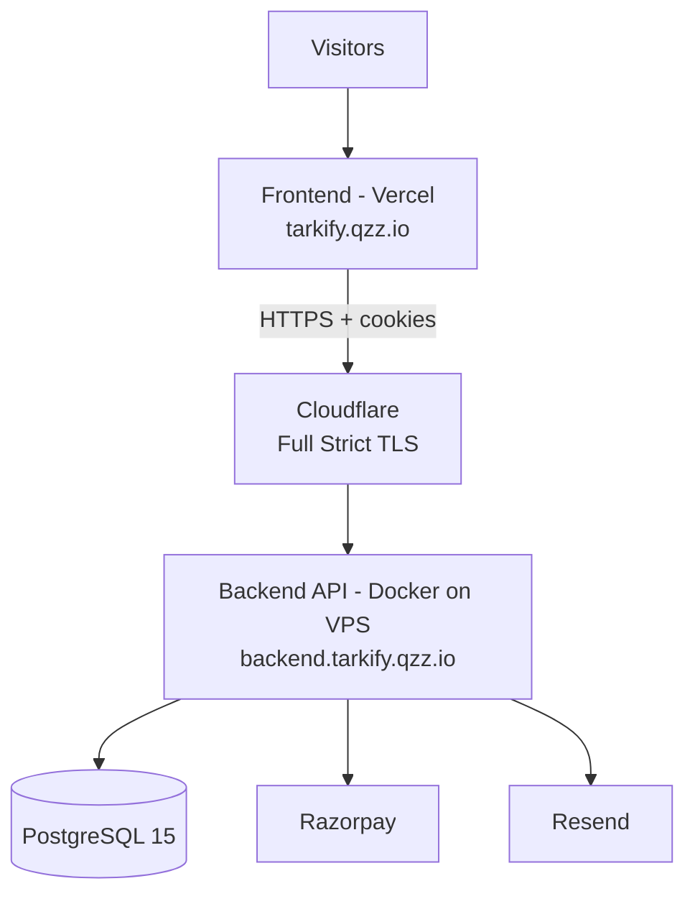

# Deployment

> **Scope**: Development, Docker, VPS, Cloudflare, Resend, Google OAuth, env vars, production, migration, startup, health, rollback, troubleshooting.
> **Source of truth**: `backend/Dockerfile`, `docker-compose.yml`, `docker-entrypoint.sh`, `scripts/migrate.ts`, `src/config.ts`.
> **Related**: `SECURITY.md#deployment-security`, `PROJECT_STATUS.md#deployment-status`.

---

## Topology



Frontend and backend are **same-site** subdomains (`*.tarkify.qzz.io`) so `SameSite=Lax` cookies work.

---

## Development

```bash
# Backend (Docker dev)
cd backend
cp .env.example .env          # fill values; NODE_ENV=development
docker compose up --build -d
bun run db:migrate          # if not using compose auto-migrate
bun run dev                 # port 3001 (or 3009 via compose)

# Frontend
cd frontend
cp .env.example .env          # VITE_API_URL=http://localhost:3009 (or :3001)
npm install
npm run dev                   # Vite dev server (:5173)
```

> Port mismatch gotcha: `bun run dev` → `:3001`; Docker/compose → `:3009`. Set `VITE_API_URL` accordingly.

---

## Docker

**Image (`Dockerfile`)**:
- Base `oven/bun:alpine`; runs as non-root `appuser`.
- `bun install --production` (excludes dev deps).
- `docker-entrypoint.sh` copied + executable.
- Storage `/app/storage` created with `appuser` ownership.
- `EXPOSE 3001`; `ENTRYPOINT` + `CMD` for clean signal handling.

**Entrypoint (`docker-entrypoint.sh`)**:
```sh
bun run scripts/migrate.ts
exec "$@"
```
`exec` replaces the shell so SIGTERM reaches Bun directly (graceful shutdown).

**Compose (`docker-compose.yml`)** — two services:

| Setting | Value | Purpose |
|---------|-------|---------|
| `postgres` image | `postgres:15-alpine` | Managed image. |
| `pgdata` | named volume | Persists DB. |
| `postgres` ports | `expose` only | DB not host-reachable. |
| `api.depends_on` | `postgres: service_healthy` | Start order. |
| `api.init` | `true` | Signal forwarding + zombie reaping. |
| `api.stop_grace_period` | `30s` | Let in-flight requests finish. |
| `api.healthcheck` | `/api/health` every 15s, start_period 45s | Readiness gate. |
| `api.logging` | json-file, 10MB × 3 | Rotated logs. |
| `NODE_ENV` | `production` | Production mode. |
| PG creds | `${PG_USER}`/`${PG_PASSWORD}`/`${PG_DB}` | No hardcoded secrets. |

---

## VPS

```bash
# One-time
git clone <repo> /opt/tarkify && cd /opt/tarkify/backend
# create .env with production values

# Daily update
cd /opt/tarkify/backend
git pull
docker compose up -d --build
```

`restart: always` + `depends_on` + healthchecks = full auto-recovery on reboot/API crash.

---

## Cloudflare

- TLS mode: **Full (Strict)** — origin serves HTTPS; `BETTER_AUTH_URL`/`FRONTEND_URL` must be `https://`.
- Acts as TLS proxy / tunnel exposing `backend.tarkify.qzz.io`.
- **Avoid Flexible SSL** (origin sees HTTP → cookie/URL mismatches).

---

## Resend

1. Sign up at resend.com; verify a domain (TXT/MX/CNAME).
2. Create API key → set `RESEND_API_KEY`.
3. `FROM_EMAIL` must use a verified domain.
4. Dev: with no key, emails are **logged to console** instead of sent.
5. `ADMIN_EMAIL` receives admin notifications.

See `EMAIL_SYSTEM.md`.

---

## Google OAuth

- **Opt-in**: set **both** `GOOGLE_CLIENT_ID` + `GOOGLE_CLIENT_SECRET` (from Google Cloud Console).
- Omit both to disable. Partial config **throws** at startup.
- Login/register OAuth buttons are gated on `googleOAuthEnabled`.
- See `SECURITY.md#oauth`, `ARCHITECTURE.md#oauth-flow-google-opt-in`.

---

## Environment Variables

| Group | Variable | Required | Notes |
|-------|----------|----------|-------|
| General | `NODE_ENV` | Optional (default `production`) | `development` for local. |
| | `PORT` | Optional (3001) | Listen port. |
| | `FRONTEND_URL` | Optional (`http://localhost:5173`) | CORS, trusted origins, redirects. `https://` in prod. |
| | `STORAGE_PATH` | Optional (`./storage`) | Product files root. |
| | `DOWNLOAD_TOKEN_TTL_SECONDS` | Optional (600) | Token lifetime. |
| Database | `DATABASE_URL` | **Required** | Postgres connection. |
| | `PG_USER`/`PG_PASSWORD`/`PG_DB` | Optional (compose) | Variable substitution. |
| Auth | `BETTER_AUTH_SECRET` | **Required** | ≥32 chars (`openssl rand -base64 32`). |
| | `BETTER_AUTH_URL` | **Required** | `https://` in prod; OAuth + email links. |
| | `GOOGLE_CLIENT_ID`/`SECRET` | Optional (pair) | Enables OAuth. |
| Payments | `RAZORPAY_KEY_ID`/`SECRET`/`WEBHOOK_SECRET` | **Required** | `rzp_test_*` (dev) / `rzp_live_*` (prod). |
| Email | `RESEND_API_KEY` | Prod only | `re_...`. |
| | `FROM_EMAIL`/`REPLY_TO_EMAIL` | Optional | Verified domain in prod. |
| | `ADMIN_EMAIL` | **Required** | Admin notifications. |
| | `EMAIL_PROVIDER` | Optional (`resend`) | Only `resend` implemented. |
| Frontend | `VITE_API_URL` | **Required** | Backend base URL. |

**Production guardrails** (`src/config.ts`): fails fast if `BETTER_AUTH_URL`/`FRONTEND_URL` are not `https://`, if `RESEND_API_KEY` missing, or if `BETTER_AUTH_SECRET` < 32 chars. Warns if live Razorpay keys are used in non-production.

---

## Production Deployment

1. Set `NODE_ENV=production` (compose default).
2. Configure `DATABASE_URL`, `BETTER_AUTH_SECRET`, `BETTER_AUTH_URL` (https), `FRONTEND_URL` (https), Razorpay keys, `ADMIN_EMAIL`.
3. Cloudflare **Full (Strict)**.
4. `RESEND_API_KEY` set (prod email).
5. Rotate Razorpay keys to production-approved values.
6. `docker compose up -d --build`.
7. Verify: `docker compose ps` (both healthy) + `curl https://backend.tarkify.qzz.io/api/health` → `status: "ok"`.

---

## Migration Process

Runner: `scripts/migrate.ts`.

1. `waitForDatabase()` — 10 retries × 3s (cold-start Postgres).
2. Create `_migrations` tracking table if missing.
3. For each `migrations/*.sql` (sorted): `SKIP` if applied; else `BEGIN` → run → `INSERT _migrations` → `COMMIT`.
4. Non-zero exit on failure → container stops, server never starts.

**Properties**: idempotent (re-runs apply no duplicates), transactional per file, fail-safe. State reported by `/api/health` (`migrations: applied (N)`).

> Multi-instance: migrations are not externally locked. For scale-out, run a dedicated migration job before scaling, or add `pg_advisory_lock()`.

---

## Startup Sequence

```
docker compose up -d --build
  → postgres starts → pg_isready healthcheck (retries:10)
  → api starts (depends_on: service_healthy)
  → docker-entrypoint.sh as appuser
  → bun run scripts/migrate.ts  (waits for DB, applies 001..N)
  → bun run src/index.ts
        ├─ config validation (fails fast if env missing/invalid)
        ├─ testConnection() (retries 1s/2s/4s)
        ├─ record migration state
        └─ Bun.serve()
  → /api/health → status: "ok"
  → Docker healthcheck passes (start_period:45s)
  → container marked healthy → traffic accepted
```

Graceful shutdown: `SIGTERM`/`SIGINT` stop server + close DB pool (10s timeout); `init: true` + `exec` ensure Bun receives the signal.

---

## Health Checks

| Endpoint | Purpose | Returns |
|-----------|---------|----------|
| `GET /api/health` | Liveness + DB probe + migration state | `status: ok|degraded`, `database`, `migrations`, `dbError` |
| `GET /api/ready` | Readiness (DB connectivity) | readiness probe |

Used by the Docker `healthcheck` (`/api/health`, every 15s, start_period 45s).

---

## Rollback Process

- **Code rollback**: `git pull <previous-commit>` + `docker compose up -d --build`. Migrations are forward-only; down-migrations are not automated (by design — existing data stays valid).
- **Data safety**: `git pull && docker compose up -d --build` preserves data; `restart api` preserves data; `compose down` + `up -d` preserves data; **`compose down -v` destroys PG data (intentional)**.
- **Secrets rollback**: rotate keys out-of-band if compromised.

---

## Troubleshooting

| Symptom | Check |
|----------|-------|
| Container won't start | `docker compose logs api` — missing env var / migration failure. |
| DB connection refused | `pg_isready`; confirm `DATABASE_URL`; wait for Postgres healthy. |
| Emails not sent | `RESEND_API_KEY` set? `FROM_EMAIL` verified domain? `POST /api/test-email`. |
| Emails logged `skipped` | Recipient opted out of the category. |
| Auth broken cross-site | Frontend/backend not same eTLD+1 → `SameSite=Lax` cookies not sent. Use same-site subdomain or `SameSite=None; Secure`. |
| Email links land on API | Confirm `BETTER_AUTH_URL`/`FRONTEND_URL` are `https://` and same-site; verification/reset should route to frontend pages. |
| Rate limiting resets | Expected — in-memory, per-instance. Use Redis for scale-out. |
| Live-key warning | Rotate Razorpay keys; set `NODE_ENV=production` if intentional. |

---

*Frontend (Vercel) build uses `@sveltejs/adapter-node`; requires `VITE_API_URL`. See `PROJECT_STATUS.md#deployment-status`.*
