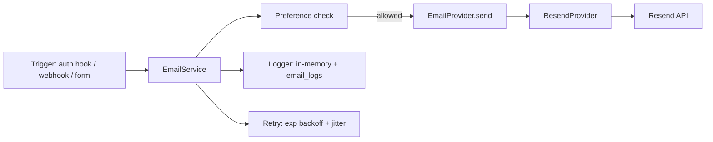
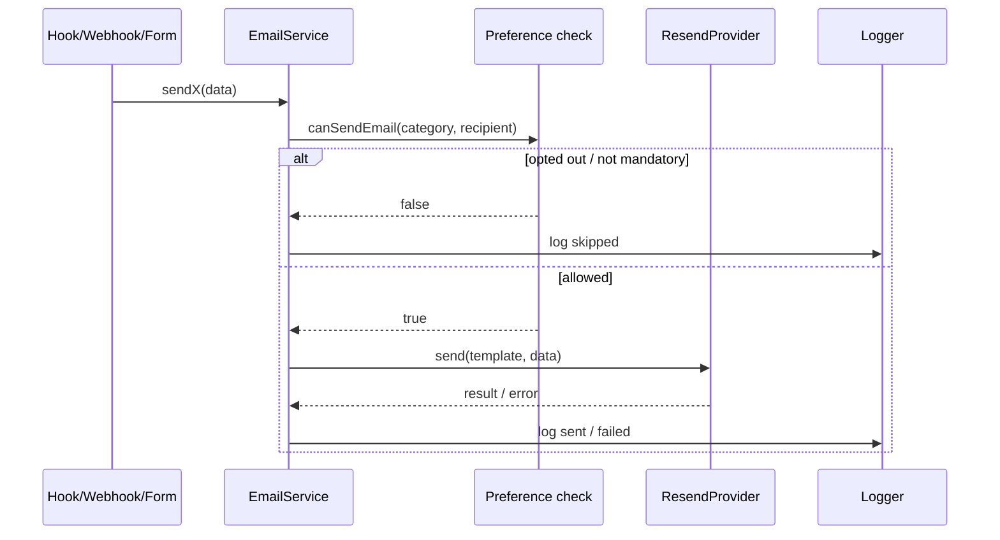

# Email System

> **Scope**: Provider abstraction, templates, retry, error handling, logging, lifecycle, all email types.
> **Provider**: Resend (only production implementation).
> **Related**: `SECURITY.md`, `DEPLOYMENT.md#resend`, `API_REFERENCE.md#email-devadmin`.

---

## 1. Provider Abstraction

- All sends route through `EmailService` (singleton `emailService`).
- `EmailProvider` interface (`provider.ts`) decouples logic from transport.
- **Only `ResendProvider` (`resend.ts`) is implemented.** `EMAIL_PROVIDER` defaults to `resend`; no other provider exists.

---

## 2. Resend

- SDK wrapped in `ResendProvider` with timeout + structured errors.
- Dev fallback: if `RESEND_API_KEY` is unset, emails are **logged to console** instead of sent.
- Production requires a verified domain; `FROM_EMAIL` must use it.
- Setup: create account → verify domain (TXT/MX/CNAME) → create API key → set `RESEND_API_KEY`.

---

## 3. Email Lifecycle

- **Preference check** runs before every send. Mandatory categories (`security`) cannot be disabled.
- **Categories**: `security` (mandatory), `billing`, `product`, `newsletter`, `marketing`.
- Preferences stored in `users.preferences` JSONB; managed via account settings.

---

## 4. Retry Logic

- Config: 1 retry, 1s base, 5s max.
- Algorithm: exponential backoff with full jitter.
- Retryable: `429`, `500`, `502`, `503`, `504`.
- Non-retryable: 4xx validation/auth, `404`.

---

## 5. Error Handling

`EmailError` hierarchy: `EmailProviderError` (statusCode, provider), `EmailRateLimitError` (429), `EmailConfigurationError`, `EmailTemplateError`.

| Provider error | HTTP | User message |
|---|---|---|
| 429 rate limit | 429 | Too many email requests. |
| 422 validation | 422 | Email service temporarily unavailable. |
| 408 timeout | 408 | Email service timed out. |
| 404 | 500 | Email service temporarily unavailable. |
| other | 500 | Unable to send [verification/reset] email. |

Better Auth callbacks (`sendVerificationEmail`, `sendResetPassword`) catch, log, and re-throw as `APIError`.

---

## 6. Logging

- **In-memory** `EmailLogger`: last 1000 entries (`to`, `subject`, `provider`, `level`, `message`, `durationMs`, `timestamp`).
- **DB** `email_logs`: `recipient`, `template`, `provider`, `provider_id`, `status` (sent/logged/skipped/failed), `error`, `sent_at`, `metadata`. Insert failures are silently caught (never block a send).

---

## 7. Templates

Built from reusable components (`components/`): `Header`, `Footer`, `Button`, `Divider`, `InfoCard`, `ProductCard`, `CodeBox`, `Alert`, `Signature`. Wrapped by `EmailLayout.ts` (responsive table, dark-mode via `prefers-color-scheme`, Google Fonts/Inter, preview text).

Theme tokens in `styles/theme.ts`. Preview all templates at `GET /api/email-previews`.

---

## 8. Email Types

| Template | Method | Category | Trigger |
|----------|--------|----------|----------|
| Verification | `sendVerificationEmail` | security (always) | Sign-up / resend |
| Password reset | `sendPasswordResetEmail` | security (always) | Forgot password |
| Purchase receipt | `sendPurchaseReceipt` | billing | Payment verified |
| Download | `sendDownloadEmail` | billing | Payment verified |
| Contact notification | `sendContactNotification` | admin (always) | Contact form |
| Contact acknowledgement | `sendContactAcknowledgement` | product | Contact form |
| Newsletter | `sendNewsletterEmail` | newsletter | Admin broadcast |
| Newsletter confirmation | `sendNewsletterConfirmation` | transactional | Subscribe |
| Newsletter unsubscribed | `sendNewsletterUnsubscribed` | transactional | Unsubscribe |
| Admin notification | `sendAdminNotification` | internal (always) | Career application |
| Test email | `sendTestEmail` | dev | `POST /api/test-email` |

**Admin notifications** go to `ADMIN_EMAIL` (contact form, career applications).

---

## 9. Future Providers

- Add a new `EmailProvider` implementation (e.g. SendGrid, SES) and register it by `EMAIL_PROVIDER` name.
- No template or `EmailService` changes required — transport is fully abstracted.
- Planned: admin-driven newsletter broadcast UI, additional preference categories, template management, delivery analytics.

---

*Environment configuration: `DEPLOYMENT.md#environment-variables`. API surface: `API_REFERENCE.md#email-devadmin`.*
